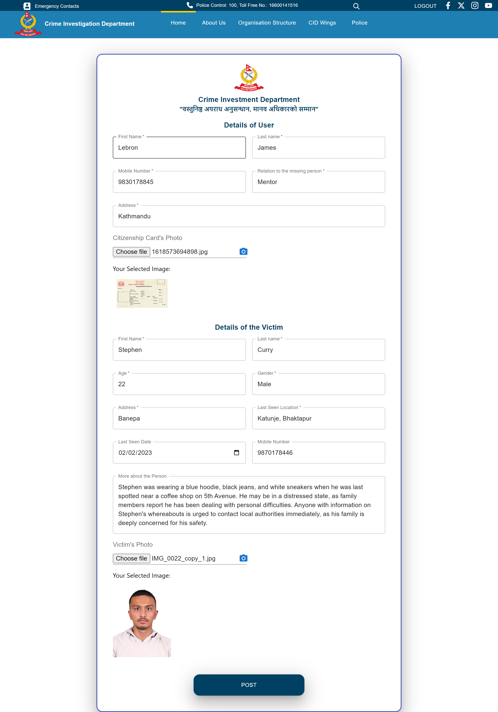
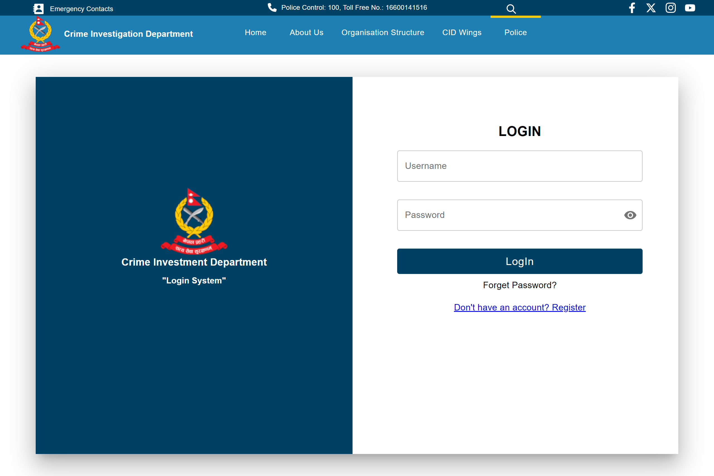
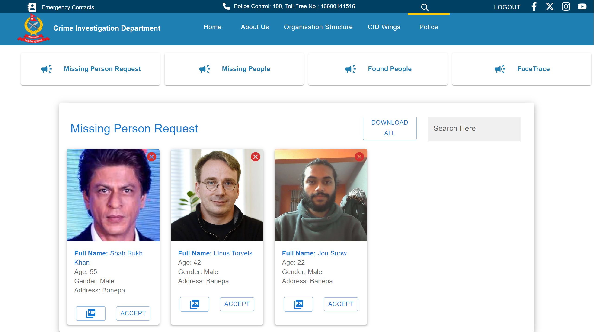
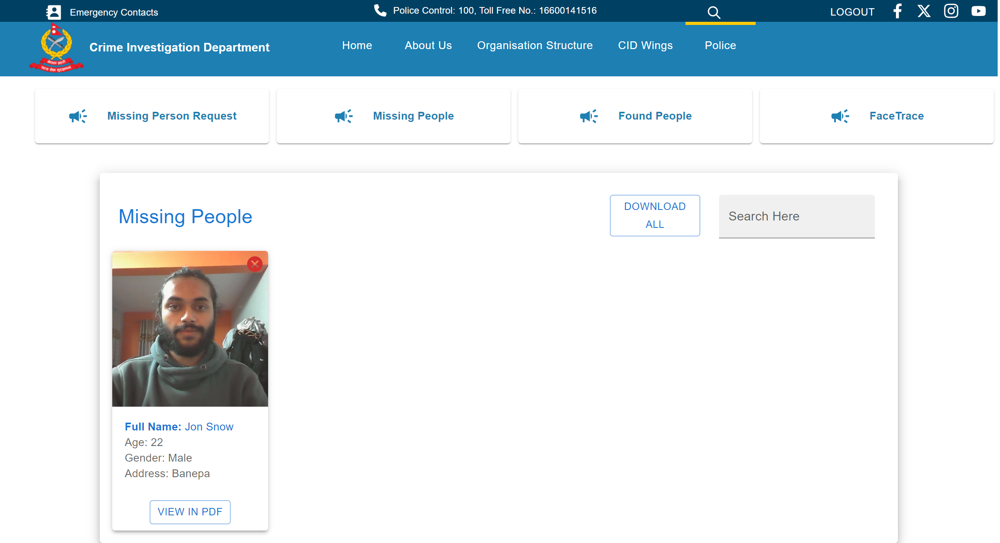
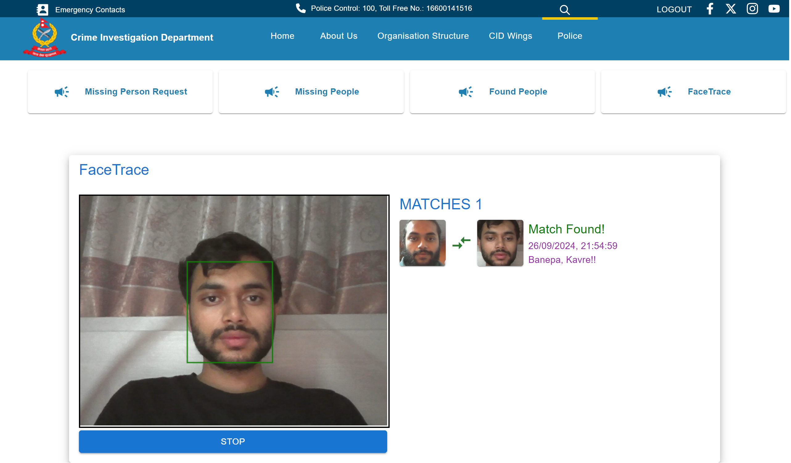
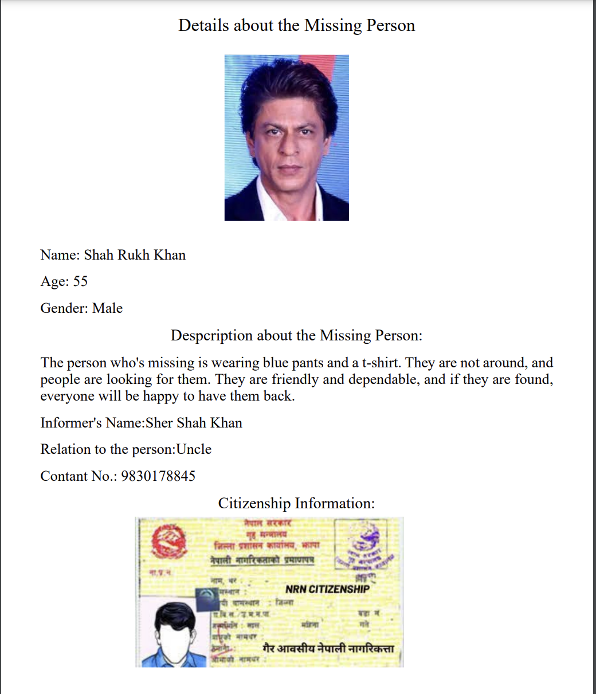

# 🚀 FaceTrace: An Advanced Facial Recognition System
## What is this project about?
FaceTrace is an advanced facial recognition system designed to aid in locating missing persons in Nepal. The project leverages Convolutional Neural Networks (CNNs), specifically utilizing the Siamese Neural Network and VGG16 architecture, for accurate facial feature extraction and recognition. The project integrates a user-friendly web platform with ReactJS on the frontend and FastAPI on the backend, enabling easy submission and retrieval of missing person reports.


## Features

- **Pattern-Matched Person Search:** Perform searches based on names, age, and gender with filtering options.
- **Refined Facial Recognition:** Combining Siamese Neural Networks and VGG16 architecture to extract detailed facial features, achieving a recognition accuracy of approximately 85%.
- **User-Friendly Interface:** Intuitive interface for users to submit missing person reports and for police officers to validate and track cases.
- **View and Download PDF:** Generate and download detailed reports on missing persons.


## Installation
### **Prerequisites**

Ensure that the following software is installed on your system:

- Python 3.10
- FastApi 0.180.0
- MongoDB 7.0
- TensorFlow v2.14.0

- **Clone the Project**

```bash
git clone https://github.com/imnabid/FaceTrace.git
```
- **Install Backend Dependencies**
Navigate to the ```backend``` folder and install the required dependencies using:

```bash
pip install -r backend/requirements.txt
```
- **Install Frontend Dependencies**
Navigate to the ```frontend```frontend folder and install dependencies using:
```bash
cd frontend  
npm install --force
```
- **Run the Application**
Open two terminals to run the backend and frontend servers.

 -   #### Backend Terminal
 ```bash
cd backend
fastapi dev main.py
```
-   #### Frontend Terminal
 ```bash
cd frontend
npm start
```

## Network Architecture 

 **1. VGG16 Architecture**
 
 <div align = "center">
 
 </div>
 
VGG16 is a deep convolutional neural network (CNN) known for its strong performance in tasks requiring feature extraction. In FaceTrace, VGG16 is used as the backbone for extracting detailed features from input images. It operates as follows:

  - **Deep Convolutional Layers:** VGG16 has 16 layers, which include convolutional layers that capture intricate hierarchical features from input images. These features are essential for identifying subtle facial characteristics.
  - **Max Pooling:** This operation reduces the spatial dimensions of the feature maps, making the model computationally efficient without sacrificing critical details.
Fully Connected Layers: The final layers of VGG16 assist in classifying and processing the features extracted earlier in the network.
In FaceTrace, VGG16 plays a pivotal role in facial feature extraction, which is used by the system to compare different facial images.

**2. Siamese Neural Network**

<div align= "center">

</div>

The Siamese Neural Network is designed to learn the similarity between two input images. It is specifically tailored for tasks like facial recognition, where comparing images is crucial. Here's how it works in FaceTrace:

  - **Twin Networks:** Two identical VGG16 networks are used to process two input images (one from the database and one captured by the webcam). Both networks share the same weights, ensuring that they learn the same features for both images.

  - **Feature Comparison:** After processing the images, the network compares the extracted feature vectors from the two images using a similarity metric (like Euclidean distance). The result is a similarity score between 0 and 1.

In FaceTrace, the VGG16 architecture is employed to extract detailed facial features from images stored in the database and those captured in real-time. These features are then passed through the Siamese network for comparison. If the similarity score between the two images is close to 1, the system confirms a match.
## System Workflow

<div align = "center">

</div>
<br>

The following steps outline the workflow of FaceTrace:

- **Step 1: Informer Submits Missing Person Information**
    - The user (informer) fills out a form on the ReactJS frontend with details such as name, age, gender, and an image of the missing person.
      
- **Step 2: Data Sent to Backend**
    - The form data is submitted to the FastAPI backend using a POST request.
    - The FastAPI backend processes the request and stores the information, including the image, in a MongoDB database. The status of each missing person entry is tracked for updates.
      
- **Step 3: Data Retrieval for Display**
    - The frontend regularly sends a GET request to the FastAPI backend to retrieve the updated missing person information from the MongoDB database.
    - The retrieved data is displayed on the frontend using Material UI components in the form of visually appealing cards, showing the details of each missing person.
      
- **Step 4: Real-Time Facial Recognition via Websockets**
    - The FastAPI server processes the facial recognition using a Siamese Neural Network model.
The images stored in the MongoDB database are compared with real-time images captured through the user's webcam.
    - Websockets facilitate real-time communication between the frontend and backend for continuous image comparison.
      
-  **Step 5: Image Matching**
    - The Siamese model compares the stored image with the real-time webcam image.
    - If the model returns a similarity score of 1, it indicates a successful match between the stored and live-captured images, confirming the identity of the person.
      
- **Step 6: Identification and Display of Matched Person**
    - Upon a match, the system generates a new card in the frontend displaying the identified individual’s details.
    - Law enforcement officers review this information and validate the identification.
      
- **Step 7: Officer Validation**
    - Officers use the displayed cards on the frontend to verify the information and take appropriate action based on the confirmed match.
      
## Screenshots

<div align="center">

</div> <br>

<div align="center">

</div> <br>

<div align="center">

</div> <br>

<div align="center">

</div> <br>

<div align="center">

</div> <br>


<div align="center">

</div> <br> 

<div align="center">

</div> <br>

